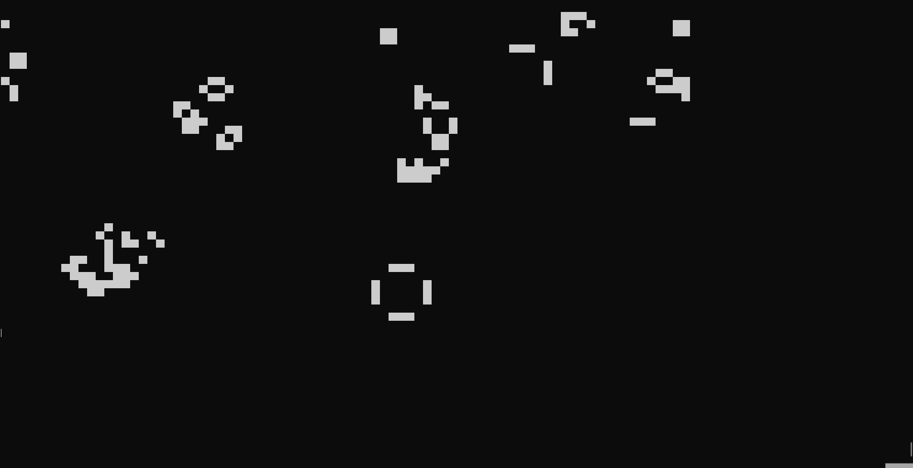

# Conway's Game of Life en Rust 

Este proyecto implementa el Juego de la Vida de Conway usando únicamente la función `point()` para renderizar celdas vivas y muertas. La simulación corre en tiempo real en la consola, sin limpiar el framebuffer entre frames.

## Captura de ejecución

A continuación se muestra una animación de la simulación en ejecución:



> También se ha subido este archivo `demo.gif` al canal de Discord como lo pide el laboratorio.

## Instrucciones de ejecución

### 1. Requisitos

- Tener Rust instalado

### 2. Ejecutar

```bash
cargo run
